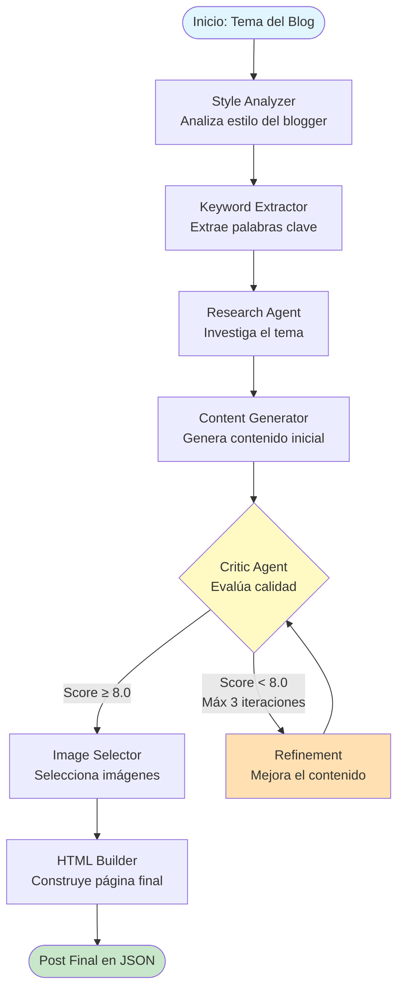

# Blogger Agent TFG

> Sistema multi-agente de IA para generar contenido de blog imitando el estilo de bloggers específicos.

---

## :globe_with_meridians: Ver los Blogs Generados

**Puedes visualizar los blogs generados en la página web de este repositorio:**

**:point_right: [https://alejandroors21.github.io/blogger-agent-tfg/](https://alejandroors21.github.io/blogger-agent-tfg/)**

El sitio está desplegado en GitHub Pages y muestra todos los posts generados por el sistema de agentes utilizando HTML estático.

---

## :bar_chart: Diagrama del Flujo DAGGR

El sistema utiliza **Daggr** (herramienta oficial de Gradio) para orquestar 7 agentes especializados que colaboran en la generación de contenido:



### :arrows_counterclockwise: Fases del Workflow

1. **Style Analyzer**: Analiza el estilo de escritura del blogger objetivo
2. **Keyword Extractor**: Identifica palabras clave relevantes del tema
3. **Research Agent**: Investiga información actualizada sobre el tema
4. **Content Generator**: Genera el contenido del post imitando el estilo
5. **Critic Agent**: Evalúa la calidad del contenido (loop de mejora)
6. **Image Selector**: Selecciona imágenes apropiadas para el post
7. **HTML Builder**: Construye la estructura HTML final del blog

---

## :rocket: Uso del Sistema

### Backend (Workflow Visual con Daggr)
```bash
cd backend
python daggr_blogger_workflow.py
# → http://localhost:7860
```

### Visualización de Blogs

Los blogs generados se publican automáticamente en:
- **GitHub Pages**: [https://alejandroors21.github.io/blogger-agent-tfg/](https://alejandroors21.github.io/blogger-agent-tfg/)
- **Archivos estáticos**: Directorio `docs/` (index.html, post.html, posts.json)

---

## :books: Documentación

- **[DAGGR_WORKFLOW.md](backend/DAGGR_WORKFLOW.md)** - Guía completa del workflow Daggr
- **[PROJECT_STATUS.md](PROJECT_STATUS.md)** - Estado actual del proyecto
- **[AGENT_ORCHESTRATION.md](AGENT_ORCHESTRATION.md)** - Orquestación de agentes

---

**Proyecto TFG - IES Rafael Alberti - 2026**