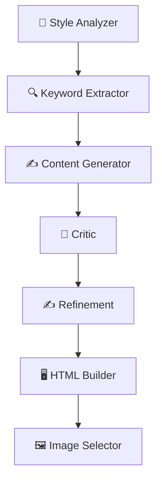

## 🌐 Ver Blogs Generados

You can view the generated blogs directly on [GitHub Pages](https://alejandroors21.github.io/blogger-agent-tfg/).

## Daggr Workflow

This flowchart illustrates the data flow between the various agents involved in the Daggr workflow.