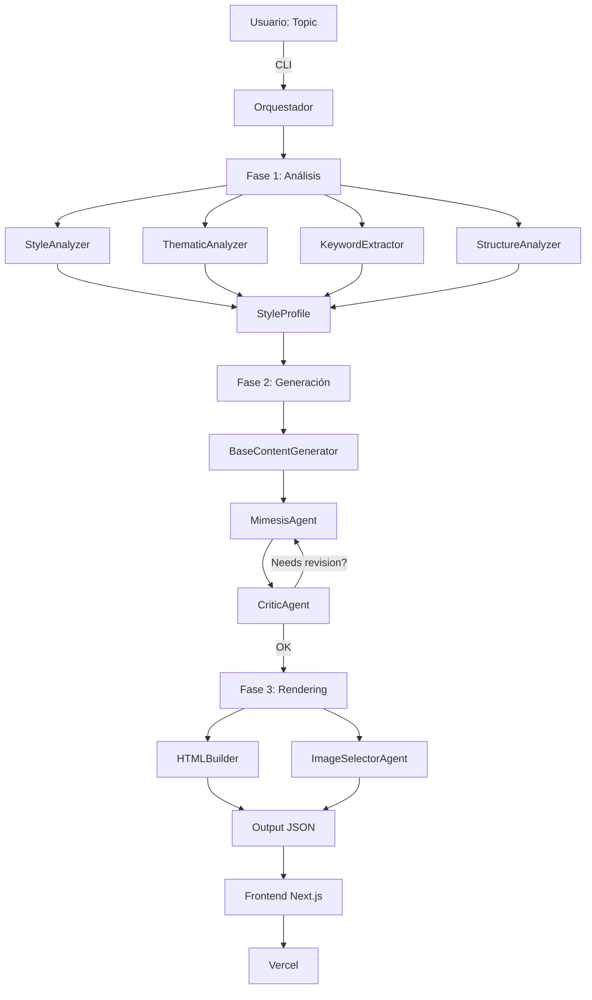

# Plan de Orquestación - Blogger Agent TFG

> ⚠️ **Documento histórico de planificación** (Feb 2026). La estructura real del proyecto puede diferir. Para el estado actual, consultá [PROJECT_STATUS.md](../PROJECT_STATUS.md) y [README.md](../README.md).

> Organización de issues, asignación a agentes, y plan de ejecución

## 📊 Estado Actual

**Issues Totales:** 7 abiertas  
**Prioridad:** 2 P1 (Alta), 3 P2 (Media), 2 P3 (Baja)  
**Estrategia:** Desarrollo paralelo con orquestación central

## 🔄 Operacion Continua (Feature 009)

### Objetivo operativo

- Publicacion continua cada 12 horas (2 publicaciones/día).
- Seleccion temática multi-fuente con fallback.
- Reintentos con backoff 5m / 15m / 30m para fallos transitorios.

### Estados operativos

- `active`: ejecución continua normal.
- `paused`: pausa manual con preservación de planificación.
- `degraded`: degradación operacional por fallos sostenidos.
- `source_exhausted`: agotamiento de fuentes confiables tras fallback.
- `skipped_with_reason`: ciclo cerrado sin publicación por falta de tema válido.

### SLI/SLO y alertas

- `SLI-1 Daily Success Rate`: porcentaje de ciclos válidos (`success` o `skipped_with_reason`).
- `SLI-2 Cycle Lag`: diferencia entre hora planificada y cierre de ciclo.
- `SLI-3 Critical Open Incidents`: incidentes críticos abiertos.
- Objetivos operativos:
  - success-rate >= 95%,
  - cycle lag <= 90 minutos,
  - incidentes críticos abiertos = 0.
- Alertas:
  - `SLI_SUCCESS_RATE_BREACH`,
  - `SLI_CYCLE_LAG_BREACH`,
  - `CRITICAL_INCIDENT_OPEN`.

### Trazabilidad

- Historial de ciclos e incidentes en `backend/outputs/continuous_history.json`.
- Artefactos canónicos publicados en `docs/posts.json` y `docs/posts/*.json`.

### Troubleshooting rápido

1. Verificar estado actual desde el orquestador (`get_operational_status`).
2. Revisar incidentes abiertos y `reason_code` en historial.
3. Confirmar disponibilidad de fuentes (API/RSS) y credenciales.
4. Reanudar operación con `resume_continuous_publishing` tras mitigación.

---

## 🎯 Fase 1: Infraestructura Core (P1) - PRIORITARIO

### Issue #9: Implementar Agente Orquestador ejecutable ⚡
**Estado:** 🔴 En desarrollo  
**Agente responsable:** `OrchestratorAgent`  
**Prioridad:** CRÍTICA - Bloquea todo lo demás  
**Tiempo estimado:** 2-3 días

**Tareas:**
- [x] Crear estructura `backend/src/orchestrator/`
- [x] Implementar `BloggerOrchestrator` clase principal
- [x] Sistema de estado (`StateManager`)
- [x] Manejo de errores y reintentos
- [x] CLI ejecutable (`runner.py`)
- [ ] Tests de integración

**Entregables:**
```bash
backend/
├── src/
│   └── orchestrator/
│       ├── __init__.py
│       ├── main.py           # BloggerOrchestrator
│       ├── state.py          # StateManager
│       ├── config.py         # Configuración
│       └── runner.py         # CLI
```

**Criterios de éxito:**
```bash
python -m src.orchestrator.runner \
  --topic "OpenClaw me alucina" \
  --blog-url "https://javipas.com" \
  --output "output.json"
# ✅ Genera JSON con contenido + imágenes
```

---

### Issue #5: Configurar Modal para deployment
**Estado:** 🟡 Pendiente (después de #9)  
**Agente responsable:** `DeploymentAgent`  
**Prioridad:** Alta  
**Tiempo estimado:** 1 día

**Dependencias:** Issue #9 completada

**Tareas:**
- [ ] Crear cuenta Modal
- [ ] Configurar `modal_app.py`
- [ ] Configurar secrets (API keys)
- [ ] Primer deploy de prueba
- [ ] Documentar en `MODAL_DEPLOYMENT.md`

**Comando objetivo:**
```bash
modal deploy backend/modal_app.py
# ✅ Devuelve: https://blogger-agent-tfg.modal.run
```

---

## 🧠 Fase 2: Agentes de Análisis (P2)

### Issue #6: Desarrollar agentes de análisis de contenido
**Estado:** 🔵 Planificado  
**Agentes responsables:** 4 agentes especializados  
**Tiempo estimado:** 3-4 días  
**Ejecución:** Paralela (pueden desarrollarse simultáneamente)

#### Agente 1: `StyleAnalyzer` 🎭
**Responsabilidad:** Analizar tono, voz narrativa, estructura
```python
# backend/aphra_blogger/agents/style_analyzer.py
class StyleAnalyzer:
    def analyze(self, blog_urls: List[str]) -> StyleProfile:
        """
        Returns:
        - tone: conversational, humorous, personal
        - voice: primera persona, cercano
        - structure: intro-experiencia-reflexión
        - expressions: ["me alucina", "dicho y hecho", ...]
        """
```

**Input:** URLs del blog (https://javipas.com)  
**Output:** `StyleProfile` dict

---

#### Agente 2: `ThematicAnalyzer` 📚
**Responsabilidad:** Extraer temáticas recurrentes
```python
# backend/aphra_blogger/agents/thematic_analyzer.py
class ThematicAnalyzer:
    def extract_themes(self, blog_urls: List[str]) -> List[str]:
        """
        Returns: ["IA", "Apple", "nostalgia tech", "familia", ...]
        """
```

**Output:** Lista de temáticas con frecuencia

---

#### Agente 3: `KeywordExtractor` 🔑
**Responsabilidad:** Palabras clave y expresiones frecuentes
```python
# backend/aphra_blogger/agents/keyword_extractor.py
class KeywordExtractor:
    def extract(self, blog_urls: List[str]) -> KeywordSet:
        """
        Returns:
        - keywords: ["OpenClaw", "Claude", "miniresort burgués"]
        - expressions: ["total, que...", "el caso es que..."]
        - frequency: dict con conteos
        """
```

---

#### Agente 4: `StructureAnalyzer` 📐
**Responsabilidad:** Analizar estructura de posts
```python
# backend/aphra_blogger/agents/structure_analyzer.py
class StructureAnalyzer:
    def analyze(self, blog_urls: List[str]) -> StructurePattern:
        """
        Returns:
        - avg_word_count: 1800
        - paragraph_length: 3-5 líneas
        - sections: ["intro personal", "desarrollo", "reflexión"]
        - use_of_images: True
        """
```

---

### Issue #2: [Research] Análisis del blog Javi Pas
**Estado:** 🟢 Base completada (documentación), pendiente implementación  
**Agente responsable:** Todos los agentes de análisis  
**Tipo:** Research + Scraping  

**Tareas:**
- [x] Documentación de patrones (Issue #2 body)
- [ ] Implementar scraper de javipas.com
- [ ] Extraer 20-30 posts para corpus
- [ ] Generar dataset de entrenamiento

**Tool sugerido:**
```python
# backend/tools/scraper.py
from bs4 import BeautifulSoup
import requests

def scrape_javipas_post(url: str) -> Post:
    # Extrae título, contenido, imágenes
    pass
```

---

## ✍️ Fase 3: Agentes de Generación (P2)

### Issue #7: Implementar agentes de generación de contenido
**Estado:** 🔵 Planificado  
**Agentes responsables:** 4 agentes de escritura  
**Tiempo estimado:** 4-5 días  
**Dependencias:** Fase 2 completada (necesita StyleProfile)

#### Agente 5: `BaseContentGenerator` 📝
**Responsabilidad:** Generar borrador inicial
```python
# backend/aphra_blogger/agents/content_generator.py
class BaseContentGenerator:
    def generate_draft(self, topic: str, context: dict) -> str:
        """
        Input: Topic + Research data
        Output: Borrador de 1500-2000 palabras
        """
```

---

#### Agente 6: `MimesisAgent` 🎭
**Responsabilidad:** Aplicar estilo Javi Pas al borrador
```python
# backend/aphra_blogger/agents/mimesis_agent.py
class MimesisAgent:
    def apply_style(self, draft: str, style_profile: StyleProfile) -> str:
        """
        Aplica:
        - Tono conversacional
        - Expresiones características
        - Estructura narrativa personal
        - Humor e ironía
        """
```

---

#### Agente 7: `CriticAgent` 🔍
**Responsabilidad:** Revisar coherencia y estilo
```python
# backend/aphra_blogger/agents/critic.py
class CriticAgent:
    def critique(self, content: str, style_profile: StyleProfile) -> Critique:
        """
        Returns:
        - coherence_score: 0-10
        - style_match: 0-10
        - suggestions: List[str]
        - needs_revision: bool
        """
```

---

#### Agente 8: `ImageSelectorAgent` 🖼️
**Responsabilidad:** Seleccionar y ubicar imágenes
```python
# backend/aphra_blogger/agents/image_selector.py
class ImageSelectorAgent:
    def select_images(self, content: str) -> List[ImagePlacement]:
        """
        Returns:
        - position: "header", "section-2", etc.
        - prompt: "Professional image of AI neural network"
        - alt_text: descripción accesible
        """
```

---

## 🎨 Fase 4: Frontend Next.js (P3) - DESPUÉS DEL BACKEND

### Issue #4: Implementar blog completo en Next.js
**Estado:** ⏸️ Pendiente (backend primero)  
**Agente responsable:** `FrontendAgent`  
**Tiempo estimado:** 5-6 días

**Dependencias:** Backend funcional + Modal desplegado

**Estructura:**
```
frontend/
├── app/
│   ├── page.tsx                    # Homepage
│   ├── posts/[slug]/page.tsx       # Post individual
│   ├── api/
│   │   └── generate-post/route.ts  # Llama a Modal
│   └── components/
│       ├── BlogLayout.tsx
│       ├── PostHeader.tsx
│       ├── PostBody.tsx
│       └── PostCard.tsx
├── public/
├── styles/
└── package.json
```

---

### Issue #8: Copiar HTML/CSS de javipas.com
**Estado:** ⏸️ Pendiente  
**Agente responsable:** `DesignAgent`  
**Tiempo estimado:** 2-3 días

**Tareas:**
- [ ] Inspeccionar CSS de javipas.com
- [ ] Adaptar a Tailwind CSS
- [ ] Replicar tipografía y colores
- [ ] Responsive design

---

## 🚀 Fase 5: Deployment (FINAL)

### Vercel Deployment (Frontend)
**Estado:** 📋 Documentado, pendiente de ejecución  
**Prerequisitos:** Frontend completado

**Pasos:**
1. Conectar repo a Vercel
2. Configurar variables de entorno
3. Deploy automático desde `main`

**Comando:**
```bash
vercel deploy --prod
```

✅ **Documentación ya creada:** `docs/VERCEL_DEPLOYMENT.md`

---

## 📅 Timeline Propuesto

```
Semana 1:
  Día 1-3: Issue #9 (Orquestador) ⚡
  Día 4-5: Issue #5 (Modal deployment)

Semana 2:
  Día 1-4: Issue #6 (Agentes de análisis) - En paralelo
  Día 5:   Issue #2 (Scraping + corpus)

Semana 3:
  Día 1-5: Issue #7 (Agentes de generación)

Semana 4:
  Día 1-5: Issue #4 (Frontend Next.js)
  
Semana 5:
  Día 1-2: Issue #8 (CSS/Design)
  Día 3-4: Testing end-to-end
  Día 5:   Deployment a Vercel
```

**Total:** ~5 semanas

---

## 🔄 Flujo de Orquestación



---

## 🎯 Métricas de Éxito

### Fase 1 (Orquestador):
- ✅ CLI ejecutable sin errores
- ✅ Logs de progreso en tiempo real
- ✅ Manejo de errores con reintentos
- ✅ Output JSON válido

### Fase 2 (Análisis):
- ✅ StyleProfile completo extraído
- ✅ Keywords relevantes identificadas
- ✅ Corpus de 20+ posts recopilado

### Fase 3 (Generación):
- ✅ Contenido de 1500-2500 palabras
- ✅ Estilo similar a Javi Pas (evaluación subjetiva)
- ✅ Coherencia y estructura narrativa
- ✅ Imágenes correctamente ubicadas

### Fase 4 (Frontend):
- ✅ Blog funcional con diseño similar
- ✅ API conectada a Modal
- ✅ Responsive design

### Fase 5 (Deployment):
- ✅ Desplegado en Vercel
- ✅ URL pública funcional
- ✅ Performance aceptable (<3s load time)

---

## 👥 Asignación de Agentes (Roles)

| Agente | Issues | Archivos |
|--------|--------|----------|
| **OrchestratorAgent** | #9 | `orchestrator/main.py` |
| **DeploymentAgent** | #5 | `modal_app.py` |
| **AnalysisTeam** | #6, #2 | `agents/style_analyzer.py`, `agents/thematic_analyzer.py`, etc. |
| **GenerationTeam** | #7 | `agents/content_generator.py`, `agents/mimesis_agent.py`, etc. |
| **FrontendAgent** | #4 | `frontend/app/**` |
| **DesignAgent** | #8 | `frontend/styles/**` |

---

## 🔧 Comandos Rápidos

```bash
# Desarrollo: Ejecutar orquestador
python -m src.orchestrator.runner --topic "IA en educación" --blog-url "https://javipas.com"

# Testing: Probar agente individual
pytest backend/tests/agents/test_style_analyzer.py -v

# Deploy backend
modal deploy backend/modal_app.py

# Deploy frontend (cuando esté listo)
vercel deploy --prod

# Run completo local
docker-compose up
```

---

## 📝 Notas Importantes

1. **Priorización:** Fase 1 (Orquestador) es bloqueante
2. **Paralelización:** Fase 2 (Análisis) puede desarrollarse en paralelo
3. **Vercel:** Se deja para el final, documentación ya lista
4. **Testing:** Cada agente debe tener tests unitarios
5. **Documentación:** Actualizar READMEs conforme avanzamos

---

**Última actualización:** 10 Feb 2026  
**Estado general:** 🟡 En progreso - Fase 1 iniciada
