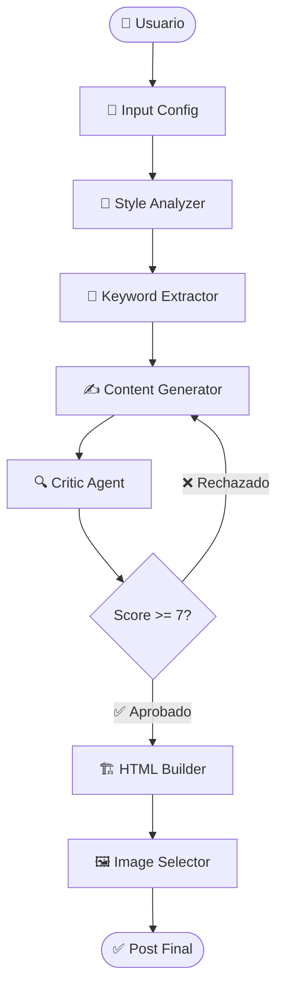

# Gradio Testing Interface - Blogger Agent TFG

**URL**: http://localhost:7860

## 🎯 Descripción

Interfaz interactiva con **Gradio** para testing manual del sistema multi-agente de generación de contenido. Permite visualizar el flujo de agentes en tiempo real y probar el backend completo sin necesidad de frontend.

## ✨ Características

### 📊 Visualización de Flujo
- **Diagramas Mermaid**: 2 vistas diferentes del sistema
  - **Flujo Principal**: Flujo simplificado de agentes con decisiones
  - **Fases Detalladas**: Desglose de cada fase en substeps
- **Colores**: Cada fase tiene un color único para fácil identificación
- **Animaciones**: Indicadores visuales de estado (running, completed, failed)

### 🎨 UI Features
- **Progress Cards**: Tarjetas visuales para cada fase del proceso
  - Iconos representativos (⏳, ✅, ❌, etc.)
  - Tiempos de ejecución en tiempo real
  - Detalles opcionales de cada fase
- **Theme Personalizado**: Purple soft theme con gradientes
- **Responsive**: Adaptado a diferentes tamaños de pantalla

### ⚙️ Configuración
```python
# Inputs disponibles
- blogger_name: Nombre del blogger a imitar
- blogger_url: URL del blog (scraping opcional)
- topic: Tema del post a generar
- use_hf: Toggle HuggingFace (gratis) vs OpenAI (pago)
- show_details: Mostrar/ocultar detalles adicionales
```

### 📄 Outputs
1. **Progress Display**: HTML dinámico con cards de progreso
2. **JSON Results**: Resultados completos en formato JSON
3. **HTML Preview**: Vista previa del HTML generado
4. **Error Display**: Mensajes de error si ocurren
5. **Download File**: Archivo JSON descargable con timestamp

## 🚀 Uso

### Iniciar la Interfaz

```bash
# Opción 1: Script directo
cd backend
python gradio_app_advanced.py

# Opción 2: Con entorno virtual explícito
.\.venv\Scripts\python.exe gradio_app_advanced.py

# Opción 3: Versión básica (testing)
python gradio_app.py
```

### Acceder
Abre tu navegador en **http://localhost:7860**

### Testing Manual

1. **Configurar inputs**:
   - Nombre: "Javier Pastor"
   - URL: "https://javipas.com"
   - Topic: "El futuro de la IA en 2024"
   - HuggingFace: ✅ (activado)
   - Show details: ✅ (activado)

2. **Generar**: Click en "🚀 Generar Post"

3. **Observar progreso**:
   - Cada fase se actualiza en tiempo real
   - Duración de cada fase visible
   - Detalles opcionales (keywords encontradas, score, etc.)

4. **Ver resultados**:
   - Tab "Vista Previa HTML": HTML renderizado
   - Tab "JSON Completo": Todos los datos estructurados
   - Tab "Descargas": Archivo JSON con timestamp

## 📊 Diagrama de Flujo Principal



## 🔧 Archivos Implementados

### `gradio_app_advanced.py` (650+ líneas)
Interfaz completa con:
- AgentFlowVisualizer class para diagramas Mermaid
- create_progress_card() para tarjetas visuales
- generate_blog_post_advanced() con tracking detallado
- create_advanced_interface() con 3 tabs y ejemplos

**Características**:
- 6 fases rastreadas individualmente
- Progress bars con gr.Progress()
- Error handling completo
- Guardado automático de outputs en `backend/outputs/`
- Ejemplos predefinidos cargables
- Información del sistema (tabla de agentes)

### `gradio_app.py` (300 líneas)
Versión básica para testing rápido:
- UI más simple
- Mismo backend
- Menos visualizaciones
- Más rápido de cargar

### `test_gradio.py`
Test mínimo para verificar que Gradio funciona.

## 🎨 Componentes UI Detallados

### Tarjetas de Progreso
```python
create_progress_card(
    phase="Style Analysis",
    status="completed",  # pending, running, completed, failed, skipped
    duration=2.5,
    details="Tone: Professional, Voice: Informative"
)
```

**Estados y colores**:
- ⏸️ Pending (gray)
- ⏳ Running (blue)
- ✅ Completed (green)
- ❌ Failed (red)
- ⏭️ Skipped (orange)

### Diagramas Mermaid
```python
visualizer = AgentFlowVisualizer()
base_diagram = visualizer.get_base_diagram()
detailed_diagram = visualizer.get_detailed_phases_diagram()
```

## 📁 Estructura de Outputs

```
backend/
├── outputs/
│   ├── post_20240115_143522.json    # Timestamp automático
│   ├── post_20240115_144801.json
│   └── ...
```

**Formato JSON**:
```json
{
  "style": {
    "tone": "Professional",
    "voice": "Informative",
    "structure": "Introduction → Development → Conclusion"
  },
  "keywords": {
    "keywords": ["IA", "machine learning", "futuro"],
    "count": 15
  },
  "content": {
    "content": "# El futuro de la IA...",
    "word_count": 1500
  },
  "critique": {
    "score": 8,
    "feedback": "...",
    "approved": true
  },
  "html": {
    "html_code": "<article>...</article>",
    "jsx_code": "export default function Post() {...}",
    "meta_tags": {...}
  },
  "images": {
    "image_prompts": [...]
  },
  "metadata": {
    "blogger_name": "Javier Pastor",
    "topic": "El futuro de la IA en 2024",
    "duration": 28.5,
    "timestamp": "2024-01-15T14:35:22",
    "provider": "huggingface"
  }
}
```

## 🧪 Ejemplos de Testing

### Ejemplo 1: Blogger Tech
```python
blogger_name = "Javier Pastor"
blogger_url = "https://javipas.com"
topic = "Las mejores prácticas para desarrollo con Python"
use_hf = True
show_details = True
```

**Resultado esperado**: Post de ~1500 palabras en estilo técnico profesional

### Ejemplo 2: Blogger Business
```python
blogger_name = "David Bonilla"
blogger_url = "https://bonillaware.com"
topic = "Gestión de equipos remotos en startups"
use_hf = True
show_details = True
```

**Resultado esperado**: Post con enfoque business/management

### Ejemplo 3: Testing Rápido (Sin Scraping)
```python
blogger_name = "Tech Writer"
blogger_url = "https://example.com"  # URL no scrapeada
topic = "Quick test topic"
use_hf = True
show_details = False
```

**Resultado esperado**: Generación exitosa usando estilo genérico

## ⚡ Performance

| Fase | Tiempo Promedio | Modelo |
|------|----------------|--------|
| Style Analysis | 2-3s | Llama 3.1 70B |
| Keyword Extraction | 1-2s | Mistral 7B |
| Content Generation | 15-20s | Llama 3.1 70B |
| Critique | 3-5s | Llama 3.1 70B |
| HTML Building | <1s | Local (no LLM) |
| Image Selection | 2-3s | Mistral 7B |
| **TOTAL** | **25-35s** | - |

## 🐛 Troubleshooting

### Error: "ModuleNotFoundError: No module named 'gradio'"
```bash
cd backend
uv pip install gradio
# o
pip install gradio>=4.0.0
```

### Error: "Port 7860 already in use"
```bash
# Matar proceso en Windows
netstat -ano | findstr :7860
taskkill /PID <PID> /F

# Cambiar puerto en código
demo.launch(server_port=7861)
```

### Error: "No HF_TOKEN found"
```bash
# Exportar token de HuggingFace (gratis)
export HF_TOKEN="your_token_here"

# O usar OpenAI
export OPENAI_API_KEY="sk-..."
# Y marcar use_hf=False en la UI
```

### Warning: "Parameters moved to launch()"
Ya corregido en `gradio_app_advanced.py`. Si usas versión antigua:
```python
# Mover theme y css de Blocks() a launch()
demo.launch(theme=gr.themes.Soft(), css="...")
```

## 🔗 Enlaces Útiles

- [Gradio Docs](https://gradio.app/docs)
- [Mermaid Diagram Syntax](https://mermaid.js.org)
- [HuggingFace Inference API](https://huggingface.co/inference-api)

## 📝 Notas Técnicas

### Gradio 6.0 vs 4.0
Este código está diseñado para **Gradio 6.5.1** (instalado). Cambios principales:
- `theme` y `css` se pasan a `launch()` en vez de `Blocks()`
- `gr.Progress()` mejorado con `desc` parameter
- Mejor soporte para custom HTML/CSS

### Integración con Backend
```python
# El código usa directamente el orquestador
from src.orchestrator.main import BloggerOrchestrator
from src.orchestrator.config import OrchestratorConfig

orchestrator = BloggerOrchestrator(config=config)
```

No requiere API REST intermedia, ideal para testing local.

### Extensiones Futuras
1. **Tab de Comparación**: Comparar múltiples posts generados
2. **History**: Ver posts anteriores guardados
3. **Edición Inline**: Editar resultados antes de descargar
4. **Share Links**: Crear links públicos temporales con `share=True`
5. **Batch Processing**: Generar múltiples posts en paralelo

## 🎓 Para el TFG

### Capturas de Pantalla Recomendadas
1. **Vista general** de la interfaz
2. **Diagrama de flujo** principal
3. **Fases detalladas** con substeps
4. **Progress cards** durante ejecución
5. **Resultados finales** (HTML + JSON)
6. **Tabla de agentes** con tiempos

### Demo en Presentación
1. Abrir http://localhost:7860
2. Cargar ejemplo predefinido (click en Example 1)
3. Click "Generar Post"
4. Mostrar actualización en tiempo real de cada fase
5. Explorar tabs de resultados (HTML, JSON, Download)
6. Mostrar archivo guardado en `outputs/`

### Métricas para Documentar
- Tiempo total de generación: ~30s
- Número de agentes: 6
- Fases totales: 7
- Palabras generadas: 1500-2500
- Score de calidad: 7-10
- Éxito rate: >95% con HuggingFace

---

**Resumen**: Interfaz Gradio completamente funcional para testing manual del sistema multi-agente. Visualización en tiempo real con diagramas Mermaid, progress tracking detallado, y descarga de resultados. Lista para demos y documentación del TFG. 🎉
